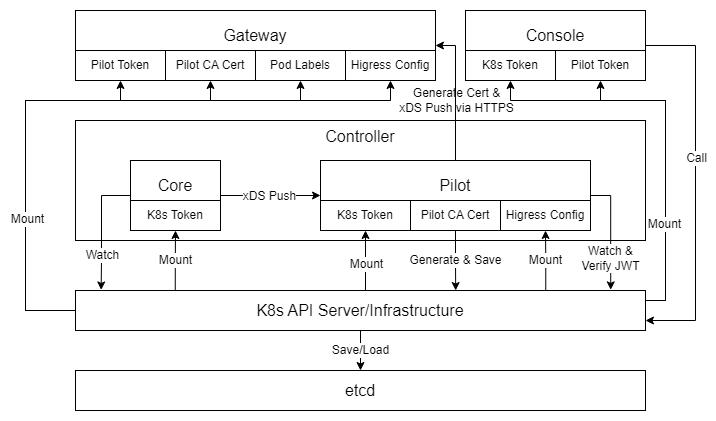
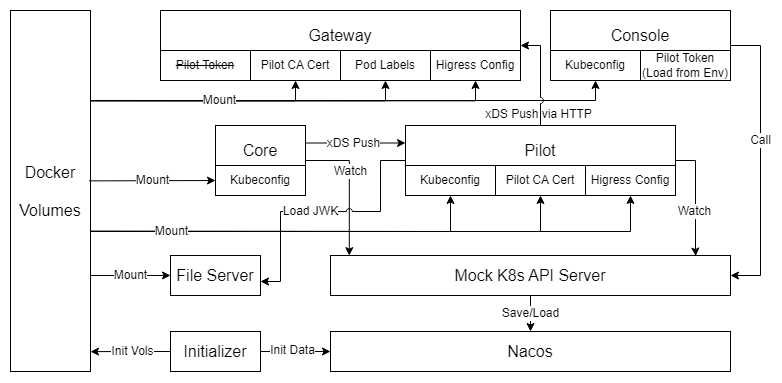

# 方案整体设计

## K8s 部署架构介绍

在设计脱离 K8s 的部署架构前，我们首先需要了解 K8s 内部署中各个组件的依赖关系以及 K8s 本身在其中发挥的作用。

上图简单描述了 Higress 的各个组件在 K8s 内部署时的组件间依赖关系。从图中我们可以看出，K8s 基础设施主要提供了以下三个功能：

1. 资源管理：这应该是 K8s 中我们最熟悉的一类功能。各个组件可以访问 K8s API Server 来对各种资源执行 CRUD 操作，并监听资源的变化。所有的数据都保存在 etcd 中；
2. 配置下发：各个 Pod 可以通过卷挂载（Volume Mount）的方式将 K8s 中的 ConfigMap、ServiceAccount Token 等配置挂载到 Pod 的存储系统中。各个 Pod 可以读取其中的配置，或使用挂载上来的 Token 访问 K8s API 或者其他相关 API；
3. 请求认证：K8s 可以做为一个 OIDC 服务提供方，像服务调用方下发 JWT Token。调用方可以在请求中带上这个 Token，这样服务方可以通过 K8s API 对 Token 进行验证并获取其关联的调用方的相关信息。只有通过认证的的调用方才可以正常访问目标服务。

下面我们整理一下图上涉及到的配置数据：

1. K8s Token：在相关组件访问 K8s API 的时候，需要通过 Token 进行认证。这个 Token 是关联到 Pod 的 ServiceAccount 上的，这样 Pod 内的进程就可以访问 ServiceAccount 被授权的 K8s 资源；
1. Pilot CA Cert：为了在 Pilot 和 Gateway 之间进行 mTLS 通信，Pilot 会在启动后生成一个 Root Cert 和 CA Cert。前者会以 ConfigMap 的形式保存在 K8s 中并挂载到 Gateway 上；而后者则是由 Root Cert 签发，在与 Gateway 的通信中负责向 Gateway 签发证书。这时 Gateway 也可以通过挂载上来的 Root Cert 验证 Pilot 证书的合法性；
1. Pilot Token：在 Gateway 向 Pilot 申请证书时，需要提供 Pilot Token 来认证其自身身份。这个 Token 由 K8s 生成，并挂载到 Gateway Pod 上；
1. Higress Config：这是一个 ConfigMap，其中包含控制面和数据面的两个全局配置文件：mesh 和 meshNetworks
1. Pod Labels：这个比较简单，就是所在 Pod 的 Label 列表。在 xDS 通信中，Gateway 会上报自己的 Label 信息，然后 Pilot 可以根据这些 Label 过滤出并下发出对应的配置数据。

## 无 K8s 部署介绍

既然要脱离 K8s 来部署 Higress，所以我们需要为上面的三个功能点找到对应的替代方案。而在部署环境方面，我们选择了使用 Docker Compose 进行部署，这样不仅可以屏蔽掉宿主操作系统带来的差异，也可以利用 Docker 的卷挂载（Volume Mount）机制实现类似的配置下发功能（但仍需要解决配置的生成问题）。

上图描述了在使用 Docker Compose 部署 Higress 时的整体架构。我们来看一下其中的几个变化：

1. Mock K8s API Server + Nacos：为了尽可能的不修改 Higress 的代码，所以我们仍旧保持了使用 K8s API 来进行资源管理的方式。这里参考了 K8s 官方开源的 sample-apiserver 和 apiserver-build-alpha 搭建了一个可以独立运行的“伪” K8s API Server。同时，后端存储也则从 etcd 换成了同为阿里开源配置中心 Nacos。关于配置模型部分，大家可以查阅 [Nacos 配置模型设计](./nacos.md) 文档；
2. Docker Volumes：Docker Volumes 替换了之前 K8s 内置的 Volume Mount，用来向各个容器下发配置数据。所有的配置数据都会以文件的形式保存在对应的 Volume 中。而这些文件的来源就是另一个新增组件：Initializer；
3. Initializer：这是个非驻留的容器。在整个系统启动的时候，它会在所有 Higress 组件前启动，负责初始化 Nacos 和各个 Volume 中的数据，包括 API Server 所使用的证书、访问 K8s API 所使用的 kubeconfig 文件、Pilot 的 Root Cert 和 CA Cert、各种 JWT Token 以及 Nacos 中的基础配置等等。在完成以上初始化工作后，它就会退出；
4. File Server：这是一个很奇怪的组件。在部署在 K8s 中时，JWT Token 的认证是通过访问K8s API 来完成。目前我们的 K8s API 暂时还不具备这一功能，而且 JWT Token 的下发也不是由 K8s 基础设施完成的，所以我们为 Pilot 选择了一个不依赖 K8s API 的 Token 认证方式，也就是通过一个外部传入的 JWK 来进行认证。但这个 JWK 并不支持静态配置到环境变量或文件中，必须通过一个 URL 来运行时加载。所以 Initializer 会将这组 JWK 数据保存在一个 Docker Volume 中。这个 Volume 会挂载到 File Server 上。这样 Pilot 就可以访问 File Server 来拿到这组 JWK 了；
5. ~~Pilot Token~~：这个 Pilot Token 说的不是右上角给 Console 使用的，而是正上方 Gateway 原本使用的。这个 Token 会用在 Gateway 像 Pilot 申请证书时。但这一部分的认证机制目前暂时还没有完全研究透。所以 Gateway 和 Pilot 之前见的 xDS 通信从之前的 HTTPS 协议改为了 HTTP 协议。这样就不再需要申请证书了，所以也就不需要挂载这个 Token 了。

## 代码结构

- apiserver：Mock K8s API Server 的代码
- compose：Docker Compose 配置目录
  - env：保存各个容器的环境变量配置
  - fileServer：保存 File Server 的容器配置
  - initContainer：保存 Initializer 的容器配置

## 参考资料

- https://github.com/kubernetes/sample-apiserver
- https://github.com/kubernetes-sigs/apiserver-builder-alpha
- https://www.zhaohuabing.com/post/2020-05-25-istio-certificate/
- https://www.huayun.com/news/1266.html
- https://github.com/rakutentech/jwkgen